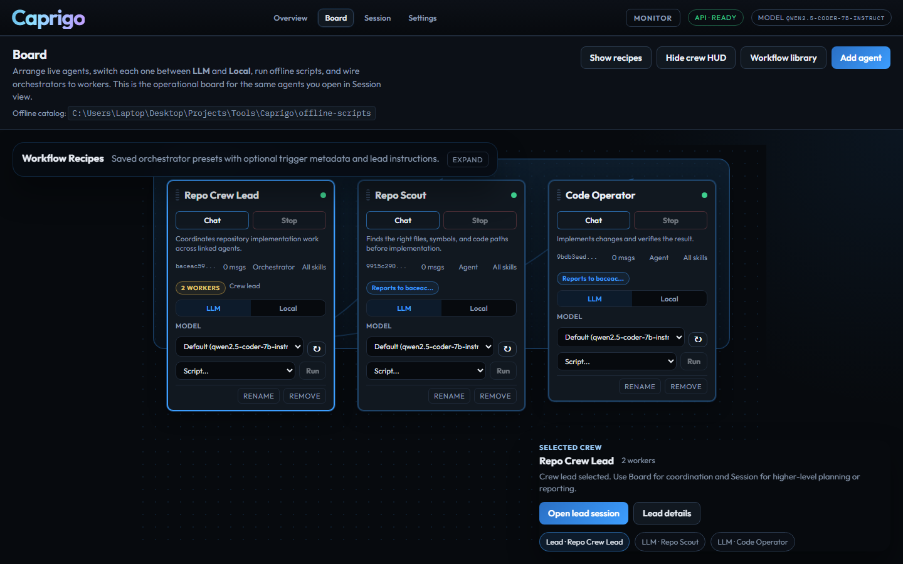
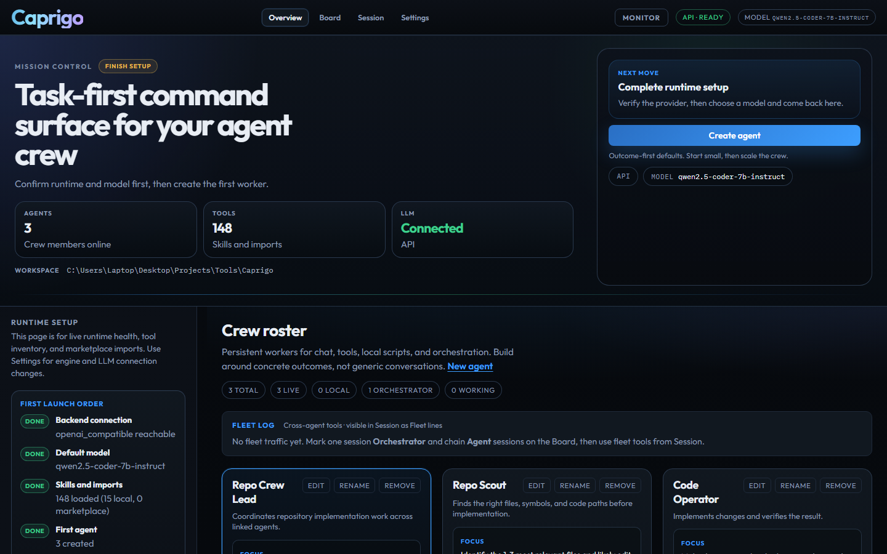

# Caprigo

[](https://myhits.vercel.app)
[](https://caprigoai.com)
[](LICENSE)

**Local-first agent workspace.** Connect your model once, launch persistent agents, and operate them across chat, tools, scripts, and multi-agent crews — on your machine, with full visibility.

Not another chat box with a thin tool wrapper.

**Product:** [caprigoai.com](https://caprigoai.com) · **Skills marketplace:** [vibes-coded.com](https://vibes-coded.com) · **Repo:** [github.com/doteyeso-ops/caprigo](https://github.com/doteyeso-ops/caprigo)



## Why people use Caprigo

Most AI products still land in one of three buckets:

- **chat-first assistants** that answer questions but do not feel like operators
- **hosted agent wrappers** abstracted away from the machine where work actually happens
- **workflow automators** that connect steps but do not feel like persistent, adaptable workers

Caprigo targets a different lane:

| You get | What it means |
|--------|----------------|
| Persistent agents | Named workers with objectives, history, and runtime state — not disposable prompts |
| Local execution | Files, shell, scripts, and tools run where your work already lives |
| Model-agnostic backends | Ollama locally or any OpenAI-compatible API (LM Studio, OpenRouter, Groq, …) |
| Operational visibility | Trace exports, crew boards, orchestrator links, and session task state |
| Expandable skills | Local JS skills, `SKILL.md` playbooks, MCP tools, marketplace imports |

The pitch is not vague autonomy. The pitch is **operable agents you can inspect, equip, and reuse**.

## Screenshots

| Overview | Board (crew ops) |
|----------|------------------|
|  |  |

Deep links: `/?tab=overview` · `/?tab=board` · `/?tab=session`

## Built-in workflow crews

Launch from **Overview** or **Board** without wiring everything by hand:

- **Repo Crew** — repo scout + code operator under a lead
- **Automation Crew** — local script runner + ops reporter
- **Launch Audit Crew** — surface checker + risk reviewer for ship-readiness
- **PR Review Crew** — diff scout + risk reviewer for merge review

Board extras: **Workflow library**, **Workflow Recipes** (saved orchestrator presets), crew strip, and **Heavy** trace badges when a session looks expensive.

## Quick start

```bash
git clone https://github.com/doteyeso-ops/caprigo.git
cd caprigo
npm install
npm run build
npm run build:web
npm run start
```

Open **http://127.0.0.1:18789** — gateway serves API + dashboard.

**Windows (recommended):**

```powershell
.\setup.ps1
```

Already configured? `.\launch.ps1`

**First-run helpers:**

```bash
caprigo setup --interactive
caprigo doctor
caprigo agents create -n "Coder"
```

See [INSTALL_AND_FIRST_RUN.md](INSTALL_AND_FIRST_RUN.md) for the full beta path.

## Example use cases

**Coding operator** — one agent implements, one reviews, one orchestrator delegates. All in one workspace with file tools and shell access.

**Research desk** — gather sources, summarize, package output. Agents stay on the board instead of shuttling tabs.

**Local script runner** — mix LLM agents with offline runtime modes for tasks that do not need model reasoning every step.

**Skill builder** — prototype skills locally, test against live agents, import from [vibes-coded.com](https://vibes-coded.com), refine before release.

## Add your own skills

Drop a `.js` file into `./skills/` or `~/.caprigo/skills/`. For Agent Skills (`SKILL.md`), use `./skills/agentskills/`.

```javascript
module.exports = {
  name: 'my_skill',
  description: 'What it does',
  execute: async (params) => {
    return { success: true, result: 'done' };
  },
};
```

Restart the gateway after adding skills. Core retrieval tools include `repo_map` and `codebase_context` for cheaper, smarter code exploration before `read_file`.

## Trace visibility

Lightweight replay without a separate observability stack:

- Per-session trace with rationale, result summaries, and output-size estimates
- Rough token/cost heuristics (`light` / `watch` / `heavy`)
- Markdown/JSON export from agent details

## What ships in this repo

- **Caprigo Core** — gateway, agent loop, skills, sessions, orchestration APIs
- **Caprigo CLI** — `caprigo` for setup, doctor, chat, agents, skills
- **Web workspace** — Overview, Board, Session, Settings
- **Optional** — MCP client, Windows-MCP integration, Vibes marketplace import

## Project docs

- [INSTALL_AND_FIRST_RUN.md](INSTALL_AND_FIRST_RUN.md) — beta install path
- [SOCIAL_LAUNCH.md](SOCIAL_LAUNCH.md) — ready-to-post launch copy
- [BETA_SMOKE_TEST.md](BETA_SMOKE_TEST.md) — release gate checklist
- [CAPRIGO_LLM_GUIDE.md](CAPRIGO_LLM_GUIDE.md) — workspace guide injected into LLM sessions
- [LANDING_PAGE_BRIEF.md](LANDING_PAGE_BRIEF.md) — public positioning

## Requirements

- Node.js 18+
- An LLM backend: [Ollama](https://ollama.ai) (default) or OpenAI-compatible API

## Status

Caprigo is in **beta**. The runtime is real; the UX is still tightening. If you try it, open an issue with what broke — that helps more than a star alone (though stars are welcome too).

## License

MIT — see [LICENSE](LICENSE).
