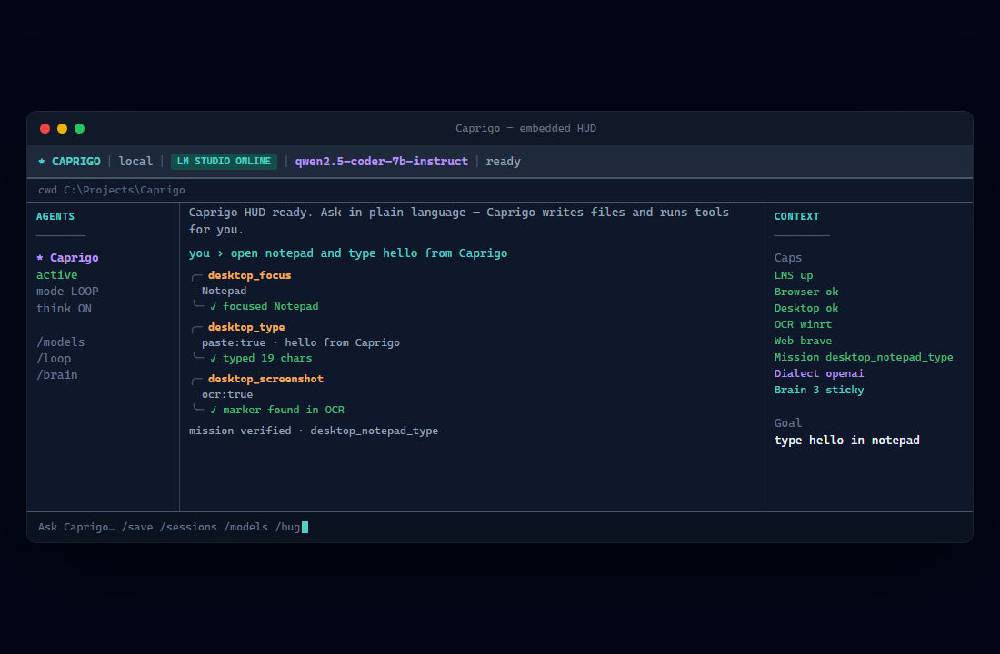
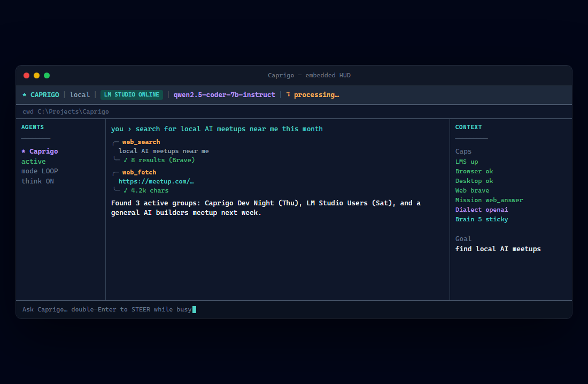
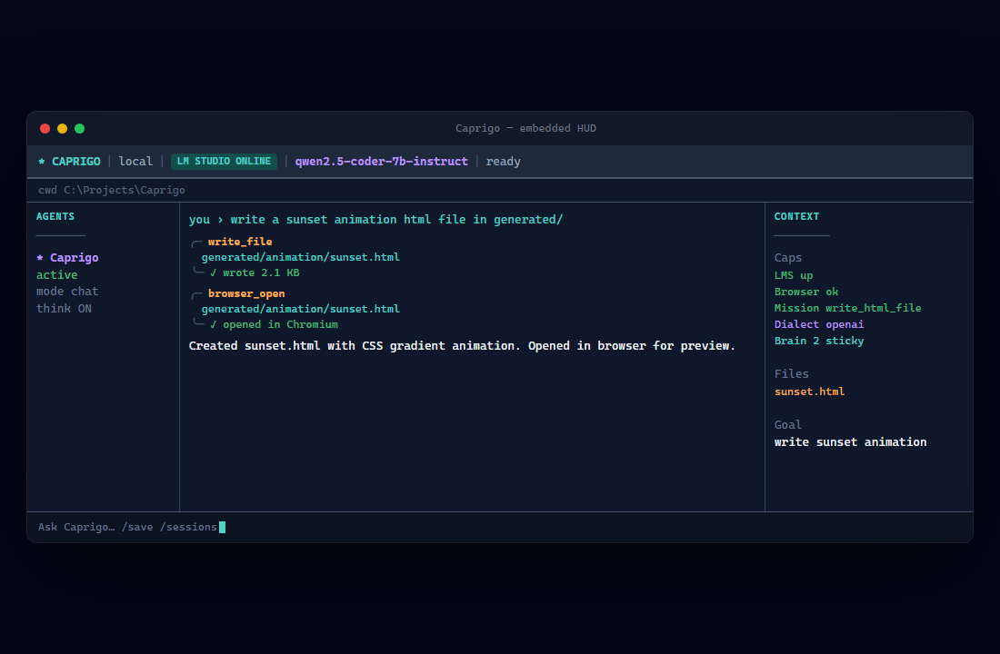

# Caprigo

[](https://myhits.vercel.app)
[](https://caprigoai.com)
[](LICENSE)

**Local-first agent harness in your terminal.** LM Studio (or any OpenAI-compatible backend) runs in-process — no gateway, no browser dashboard required.

| | |
|-|-|
| Product | [caprigoai.com](https://caprigoai.com) |
| Repo | https://github.com/doteyeso-ops/caprigo |
| Credit | **b_Radford** · Vibes-Coded |
| Marketplace | [vibes-coded.com](https://vibes-coded.com) |



<p align="center">
  
  
</p>

## Quick start

```powershell
git clone https://github.com/doteyeso-ops/caprigo.git
cd caprigo
npm install
npm run build
# LM Studio: enable Local Server, load a tool-capable model
.\launch-hud.ps1
```

Or after build:

```bash
caprigo          # embedded HUD (default)
caprigo tui      # explicit
caprigo doctor   # LM Studio / .env / permissions check
caprigo connect  # discover LM Studio and write .env
```

Windows one-shot setup:

```powershell
.\setup.ps1 -LaunchHud
```

## Configure LM Studio

Copy `.env.example` → `.env`:

```env
CAPRIGO_LLM_PROVIDER=openai_compatible
OPENAI_BASE_URL=http://127.0.0.1:1234/v1
DEFAULT_MODEL=qwen2.5-coder-7b-instruct
CAPRIGO_HARNESS_MODE=1
```

## What the HUD gives you

| Pane | Purpose |
|------|---------|
| **Header** | LM Studio online/offline, model, busy pinwheel |
| **Agents** | Session list, `/loop`, `/think`, `/models` |
| **Session** | Live tool cards, replies, mission progress |
| **Context** | Caps (Desktop, OCR, Web, Brain, Dialect, Mission) |
| **Input** | Double-Enter send (STEER), `/bug`, `/brain`, `/clear` |

Harness features: **HOME** playbooks (notepad, web, write file), **desktop_*** body, **brain** lessons, **stumble** recovery, **model grapple** dialect profiles.

## Screenshots

Regenerate marketing PNGs from the HUD mock:

```bash
npm run screenshots
```

See [docs/SCREENSHOTS.md](docs/SCREENSHOTS.md) for asset list and live terminal capture tips.

## 8GB / scrap GPUs

`CAPRIGO_LEAN_TOOLS=1` — lean tool catalog. Mission-scoped tools also keep LM Studio prefill small.

## Docs

- [INSTALL_AND_FIRST_RUN.md](INSTALL_AND_FIRST_RUN.md)
- [SOCIAL_LAUNCH.md](SOCIAL_LAUNCH.md)
- [docs/SCREENSHOTS.md](docs/SCREENSHOTS.md)
- [HandOff.md](HandOff.md)
- [docs/AMD.md](docs/AMD.md)

## License

MIT — see [LICENSE](LICENSE).
